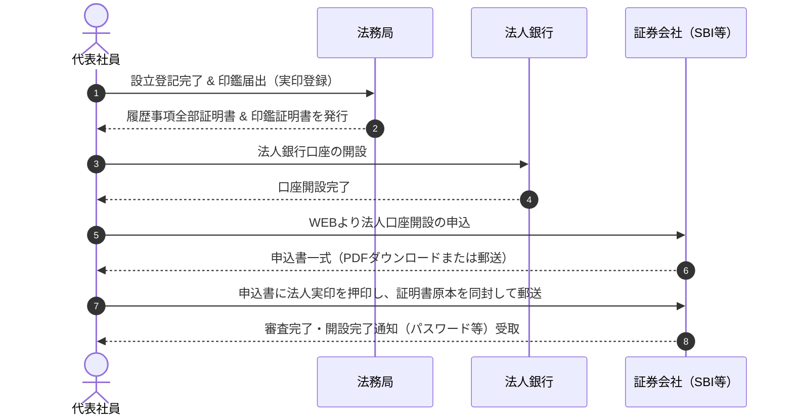
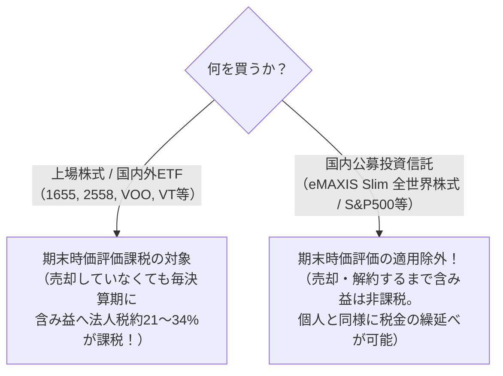

# 法人の証券口座開設・運用ガイド（インデックス投資編）

本ドキュメントは、合同会社などのマイクロ法人において**証券会社の法人口座を開設し、余剰資金や事業資金でインデックス投資を安全かつ低コストで運用するための完全ガイド**です。

---

## 🎯 法人でインデックス投資を行うメリット

1. **口座維持費・年会費が完全無料（0円）**:
   - 主要ネット証券であれば、口座維持費は一切かかりません。
2. **事業経費・赤字との完全な損益通算**:
   - 個人の投資（分離課税）とは異なり、法人の投資信託売却益は**法人の役員報酬、PC機材代、開発費、取材費などの「経費（損金）」と完全に相殺**できます。
3. **長期的な資産形成・再投資**:
   - 法人で得た事業売上（KDP印税、アプリ収益、YouTube広告等）を個人に移さず、法人口座内でそのまま再投資に回すことで、個人の所得税・住民税を発生させずに複利効果を享受できます。

---

## 🏢 主要ネット証券の比較（おすすめ）

| 証券会社 | 口座維持費 | 特徴・メリット | おすすめ度 |
| :--- | :---: | :--- | :---: |
| **SBI証券** | **無料** | ・投信取扱数トップクラス（eMAXIS Slim等すべて網羅） ・住信SBIネット銀行との連携がスムーズ | ⭐⭐⭐⭐⭐（第1推奨） |
| **楽天証券** | **無料** | ・管理画面のUIが直感的で使いやすい ・楽天・プラスシリーズ等の低コスト投信が充実 | ⭐⭐⭐⭐（第2推奨） |
| **マネックス証券** | **無料** | ・クレカ積立等の機能あり（法人カード対応状況は要確認） | ⭐⭐⭐ |

> [!TIP]
> ネット銀行として「住信SBIネット銀行」を開設する場合は、**SBI証券**をセットで選ぶと資金移動（即時入出金）の手間・手数料がゼロになり最も効率的です。

---

## 📋 口座開設の必要書類チェックリスト

法人の証券口座は、マネーロンダリング防止（犯罪収益移転防止法）のため**厳格な実印・原本審査**が行われます。

- [ ] **法人口座開設届出書**（証券会社のWEBサイトから出力または郵送受取）
  - ※**法人実印（法務局届出印）の押印が必須**
- [ ] **履歴事項全部証明書（原本）**
  - ※発行日から**6ヶ月以内**のもの（法務局で取得、1通約600円）
- [ ] **法人の印鑑証明書（原本）**
  - ※発行日から**6ヶ月以内**のもの（法務局で取得、1通約450円）
- [ ] **取引責任者（代表者）の本人確認書類**
  - ※運転免許証（両面コピー）またはマイナンバーカード（表面のみコピー）
- [ ] **法人の銀行口座情報**
  - ※証券口座からの出金先となる法人口座（GMOあおぞら、住信SBIなど）
- [ ] **法人番号（13桁）**
  - ※国税庁の公表サイトで確認できる番号

---

## 🛠 口座開設のステップ（Step-by-Step）

### ステップ 1: 事前準備（登記完了〜銀行口座開設）
1. 法人設立登記を完了させ、法務局で**印鑑届出（法人実印の登録）**を行います。
2. 法務局の窓口またはオンライン請求で以下を取得します：
   - `履歴事項全部証明書（原本）` × 1通
   - `印鑑証明書（原本）` × 1通
3. 法人銀行口座（住信SBIやGMOあおぞら等）を開設しておきます。

### ステップ 2: 証券会社WEBサイトから申込
1. SBI証券等の公式サイト「法人口座開設」へアクセス。
2. 会社情報、法人番号、本店所在地、代表者情報を入力。
3. **「取引の動機・目的」**: 「余剰資金の運用」「中長期の資産形成」などを選択。
4. **「インサイダー登録」**: 上場企業の役員等でない場合は「該当なし」。

### ステップ 3: 書類の印刷・押印・郵送
1. 申込書一式を印刷（または郵送で取り寄せる）。
2. 指定の押印箇所に、**法人実印（代表社員之印）を鮮明に押印**。
3. 履歴事項全部証明書（原本）、印鑑証明書（原本）、代表者の本人確認コピーを同封。
4. 返信用封筒にて証券会社へ郵送。

### ステップ 4: 初期設定と取引開始
1. 審査（通常1〜2週間程度）後、郵送（簡易書留）またはメールで口座開設通知が到着。
2. 初回ログインを行い、パスワード変更および法人マイナンバーの登録を実施。
3. 法人銀行口座から証券口座へ資金を入金し、積立設定または買付を開始。

---

## ⚠️ 審査落ちを防ぐための実務TIPS

### 1. 定款の「事業目的」に投資関連の文言があるか？
審査部門は法人の実態と事業目的を確認します。定款に金融・投資関連の文言が入っていないと確認が入る場合があります。
- **本リポジトリの定款（第2条第3号）にはすでに以下が明記されているためクリアです**:
  > `3. 有価証券、投資信託、不動産その他の資産を利用した投資事業`

### 2. 会社のWebサイトや事業実態の提示を求められた場合
新設法人の場合、証券会社から「事業内容が確認できる資料（会社HPのURL、事業計画書、パンフレット等）」の提出を求められることがあります。
- **対策**: 自社サイト（1枚ペラのコーポレートサイトで十分）を作成し、事業内容（ITコンサル、出版、アプリ開発、メディア運営等）を記載しておくと審査が非常に通りやすくなります。

---

## 🚨 運用・税務上の超重要ポイント（落とし穴回避）

### 1. 【最重要】「ETF」ではなく「国内公募投資信託」を買うこと！
法人でインデックス投資を行う際、最大の税務トラップが**「期末時価評価課税」**です。

- **根拠法令**: 法人税法施行令第61条の9（売買目的有価証券以外の有価証券の評価方法）
- **結論**: 特別な理由がない限り、**「分配金再投資型の国内公募投資信託（eMAXIS Slimシリーズ等）」** を選択してください。

### 2. LEI（取引主体識別子）の取得について
米国の生株や外国ETFを法人で直接取引する場合、グローバルな取引識別コード（LEI：年間維持費数万円）を求められる場合があります。
- しかし、**国内の投資信託（eMAXIS Slimなど）を購入するだけであればLEIは一切不要**です。余計な維持費は0円に抑えられます。

### 3. 法人税申告（決算書）への反映
- 投資信託を購入した金額は、貸借対照表（B/S）の**「投資有価証券」**（資産）に計上します。
- 買い付けただけでは損金（経費）にはなりません。
- 売却時に利益が出た場合、その期の**「有価証券売却益」**（収益）として計上され、他の事業経費・役員報酬と相殺されます。
